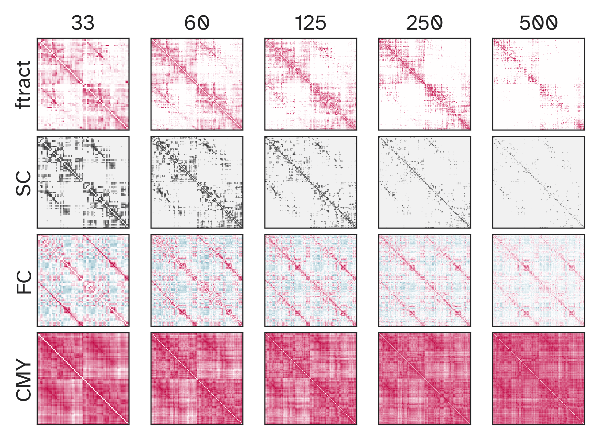

# Empirical data-driven approaches to understanding brain network dynamics
> *Master thesis project*
## Introduction 
Graph theory has become a universal analysis tool in diverse fields ranging from biology to physics, social sciences, and economics. 
Multiple systems can be studied using the same complex networks analysis.
This field has brought a powerful tool for understanding brain connectivity and characterizing how information flows within the brain. 
By unraveling these mechanisms, one can try to answer fundamental questions in neuroscience: *How can cognitive function emerge from brain dynamics? Which interactions or non-interactions are responsible for a given behavior?* In this study, different models of brain networks will be compared to empirical data in order to better understand and predict how such a complex system behaves.

Bellow you can visualize heatmaps of different brain network, relying on the Human Brain Project Dataset this python project aims to compare and predict network interactions.
 
